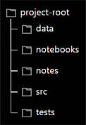
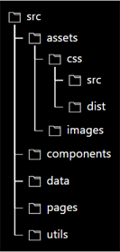

# Data Project Creation/Installation Instructions

> This guide is not intended to be read in its entirety. Only read the sections corresponding to your role in the project as defined in the *Development Roles* section below, or just use the guide as a reference when needed.

- There are two main sections in this guide based on the level of detail needed.
	1. ***High Level Steps***
		- Contains an overview of all the steps required for setting up/working with a project based on your development role.
		- Can be used as a basic checklist to keep track of where you are in the process and ensure you're not skipping any of the steps along the way.
	1. ***Detailed Steps***
		- Contains more detail, explanation, and actual code snippets for completing the corresponding high level step for a given development role.
- All steps that require a terminal are completed using git-bash unless otherwise noted.


## Development Roles
- There are two main development roles defined in this guide based on whether you are the creator of the project or just a collaborator on the project.
- Additionally, there are some installation/setup steps that both roles should complete, thus there are three roles in total defined here:
	1. ***Both (Creator and Collaborator)*** - both roles complete these sections
		- [*High Level Steps - Both (Creator and Collaborator)*](#high-level-steps)
		- [*Detailed Steps - Both (Creator and Collaborator)*](#detailed-steps)
	1. ***Creator*** - sets up the project and works on it
		- [*High Level Steps - Creator*](#section-high-level-steps)
		- [*Detailed Steps - Creator*](#section-detailed-steps)
	1. ***Collaborator*** - only works on the project
		- [*High Level Steps - Collaborator*](#section-high-level-steps-1)
		- [*Detailed Steps - Collaborator*](#section-detailed-steps-1)


## High Level Steps

#### *Development Role: Both (Creator and Collaborator)*
> For the detailed steps corresponding to this section: [*Detailed Steps - Both (Creator and Collaborator)*](#detailed-steps).

### Done Once Overall (before creating or collaborating on any projects)
1. Install Anaconda globally from [*www.anaconda.com*](https://www.anaconda.com/products/distribution).
1. Install Python globally (separately from Anaconda) from [*www.python.org*](https://www.python.org/).
1. Install `poetry` globally via script.
1. Install `node.js` globally from [*https://nodejs.org/en/*](https://nodejs.org/en/).

> **Global set up is complete. You're ready to create projects or collaborate on them!**

<hr>

#### *Section: High Level Steps*
#### *Development Role: Creator*
> For the detailed steps corresponding to this section: [*Detailed Steps - Creator*](#section-detailed-steps).

### Done Once Per Project
1. Set up GitHub repo and clone to your computer.
1. If there is an active `conda` or other python environment, deactivate it.
1. Create Python environment or use an existing one (complete one of the following):
	- **Create environment from scratch**
		> Your intention is not to use existing `environment.yml` and `pyproject.toml` files to create the environment.
		1. Create `conda` environment **and activate it**.
		1. Create `environment.yml` file from `conda` environment.
		1. Initialize `poetry` to create `pyproject.toml` and `poetry.lock`.
		1. Remove `packages` field from the `[tool.poetry]` section of `pyproject.toml`.
		1. Add dev tools and their configs to `pyproject.toml`.
		1. Install dev tool dependencies with `poetry install`.
		> **Result**: A new Python environment with dev tools ready to use. Project dependencies will need to be added to it.
	- **Create environment from existing environment files**
		> An `environment.yml` and `pyproject.toml` exist but the environment has not yet been created on your computer.
		1. Copy `environment.yml` and `pyproject.toml` into the current project's root directory.
		1. Create `conda` environment from `environment.yml` file **and activate it**.
		1. Install dependencies via `poetry install`.
		> **Result**: A new Python environment with dev tools **and** project dependencies ready to use.
	- **Use an existing Python environment**
		> An environment that already exists on your computer.
		1. Activate the environment.
		1. Copy this environment's `environment.yml` and `pyproject.toml` files into the current project's root directory.
		> **Result**: An existing Python environment with its dev tools **and** its project dependencies ready to use.
1. Make the Python environment available as a kernel to Jupyter Lab if it hasn't been made available already.
1. Add any separate dev tool config files and the dev tool CLI (command line interface) script `tools.sh` to the current project's root directory.
1. Install `pre-commit` hooks.
1. Create the project directory structure.
1. Create a `secrets.toml` file.
1. Add `secrets.toml` to `.gitignore`. **WARNING: Do not skip this step!**

#### *Optional Steps: If the plan is to include a website in the project*
1. Create the website directory structure in the `src` directory (complete one of the following):
	- **Create the directory structure from scratch**
	- **Use the *Dash Test App* `src` directory in its entirety**
		1. Download a zip file of the [*Dash Test App*](https://github.com/cdpeters/dash-test-app) project.
		1. After extracting the contents, copy the entire `src` directory from this project into the current project's root directory.
		1. Skip to the second to last step in this *Optional Steps* section (install dependencies).
1. Initialize a `package.json` file or use an existing one (complete one of the following):
	- **Initialize a `package.json` file**
		1. Initialize with `npm` to create `package.json` and `package-lock.json`.
		1. Add `tailwind` dependencies to the `package.json` file.
	- **Use an existing `package.json` file**
		1. Copy the `package.json` file and its associated `package-lock.json` file into the `src` directory.
1. Create a `tailwind.config.js` file in the `src` directory using the provided template.
1. Add the `tailwind_compile.sh` script to the `src` directory.
1. Install javascript/css dependencies found in the `package.json` file.
1. Add `node_modules/` to `.gitignore`.

> **Project creation is complete. Project is ready to be worked on and shared with collaborators!**

<hr>

#### *Section: High Level Steps*
#### *Development Role: Collaborator*
> For the detailed steps corresponding to this section: [*Detailed Steps - Collaborator*](#section-detailed-steps-1).

### Done Once Per Project
1. Clone the GitHub repo to your computer.
1. If there is an active `conda` or other python environment, deactivate it.
1. Create `conda` environment from `environment.yml` file **and activate it**.
1. Make the Python environment available as a kernel to Jupyter Lab if it hasn't been made available already.
1. Install dependencies via `poetry install`.
1. Install `pre-commit` hooks.
1. Create a `secrets.toml` file.

#### *Optional Steps: If the project includes a website*
1. Install javascript/css dependencies found in the `package.json` file.

> **Existing project set up is complete. Project is ready to be worked on and shared with collaborators!**

<hr>


## Detailed Steps

#### *Development Role: Both (Creator and Collaborator)*
> For the high level steps corresponding to this section: [*High Level Steps - Both (Creator and Collaborator)*](#high-level-steps).

### Done Once Overall (Before Creating or Collaborating on Any Projects)
1. Install Anaconda globally from [*www.anaconda.com*](https://www.anaconda.com/products/distribution).
	- `conda` will be used to manage Python virtual environments.
	- Most recent version is fine.
1. Install Python globally (separately from Anaconda) from [*www.python.org*](https://www.python.org/).
	- Python will be used to install `poetry` globally.
	- Most recent version is fine.
1. Install `poetry` globally via script.
	- `poetry` will be used for dependency management within a project.
	1. Install is via terminal script (this will give most recent version and is the preferred way to install):
		- Windows (powershell):
			```powershell
			(Invoke-WebRequest -Uri https://install.python-poetry.org -UseBasicParsing).Content | py -
			```
			> This is the only place powershell is needed, the rest of this document uses git-bash.
		- Mac (use a unix shell):
			```shell
			curl -sSL https://install.python-poetry.org | python3 -
			```
	2. Try the command `poetry --version`. If the command is not recognized, add the following to your path environment variable:
		- Windows:
			- `%APPDATA%\Python\Scripts` or `%APPDATA%\pypoetry\venv\Scripts\poetry`
		- Unix:
			- `$HOME/.local/bin` or:
				- Linux/Unix:
					- `~/.local/share/pypoetry/venv/bin/poetry`
				- Mac:
					- `~/Library/Application Support/pypoetry/venv/bin/poetry`
	3. Check installation:
		```shell
		poetry --version
		```
1. Install `node.js` globally from [*https://nodejs.org/en/*](https://nodejs.org/en/).
	- `node` will be used to install any javascript or css tools needed for the website.
	- Most recent version is fine.

> **Global set up is complete. You're ready to create projects or collaborate on them!**

<hr>

#### *Section: Detailed Steps*
#### *Development Role: Creator*
> For the high level steps corresponding to this section: [*High Level Steps - Creator*](#section-high-level-steps).

### Done Once Per Project
1. Set up GitHub repo and clone to your computer.
	1. On GitHub:
		- Create the new repository.
		- Include:
			- `README.md`
			- `.gitignore` (choose "Python" as the template if a Python project)
			- `LICENSE` (a good default choice is Apache License 2.0)
	1. Clone repo locally:
		```shell
		git clone <remote_repo_ssh_url>
		```
1. If there is an active `conda` or other python environment, deactivate it.
	- If it is a `conda` environment, deactivate using:
		```shell
		conda deactivate
		```
1. Create Python environment or use an existing one (complete one of the following):
	- **Create environment from scratch**
		> Your intention is not to use existing `environment.yml` and `pyproject.toml` files to create the environment.

		1. Create `conda` environment **and activate it**.
			```shell
			conda create --name <env_name> python=<version>
			```
			- Specify Python version so that the appropriate `pip` for that version is included.
			- Activate `<env_name>`:
				```shell
				conda activate <env_name>
				```
		1. Create `environment.yml` file from `conda` environment.
			```shell
			conda env export --from-history | grep -v "^prefix: " > environment.yml
			```
			- `--from-history` is important; this creates an environment file directly from the dependencies when the `conda` environment was created and from any packages added using `conda` during the project (i.e. does not include sub-dependencies, only the top "level" of dependencies).
			- `grep -v "^prefix: "` takes the output from export and only writes the lines that don't start with `"prefix: "` to `environment.yml`. The prefix is just the path to the virtual environment folder and likely includes our computer's username. We leave it out here so that it's not on GitHub and because `conda` doesn't need it when creating the virtual environment.
		1. Initialize `poetry` to create `pyproject.toml` and `poetry.lock`.
			- Explanation of `poetry` files:
				- `pyproject.toml`:
					- The file that holds your project and dev dependencies as well as some configuration for dev tools.
				- `poetry.lock`:
					- Generated from `pyproject.toml` via the `poetry lock` command (or auto-generated at initialization). Contains all the project and dev dependencies **and** their sub-dependencies with their versions "locked" (i.e. versions are pinned at the number that allows for environment resolution with all other dependencies). Environments will be reproduced via this file in combination with an `environment.yml` file (which captures the `conda` specific packages).
					- **DON'T MODIFY `poetry.lock` DIRECTLY!** This file should always be generated from the `pyproject.toml` file.
			- Initialization:
				```shell
				poetry init
				```
				- As you run through the initialization it is fine to accept the defaults for the `version` or `description` fields. These would be used if the project was a package and was meant to be published on PyPi.
				- This process creates `pyproject.toml` and an associated `poetry.lock` file.
		1. Remove `packages` field from the `[tool.poetry]` section of `pyproject.toml`.
			- Check the `[tool.poetry]` section of the `pyproject.toml` file. If there is a `packages` field, delete that line since these projects won't be packages.
		1. Add dev tools and their configs to `pyproject.toml`.
			1. Copy `[tool.poetry.group.dev.dependencies]` section of `pyproject.toml` and that section's contents from a previous project's repo into the current project's `pyproject.toml`.
			1. Copy any section with the heading pattern `[tool.<dev_tool_name>*]` or `[[tool.<dev_tool_name>*]]` into the current project's `pyproject.toml`.
		1. Install dev tool dependencies with `poetry install`.
			```shell
			poetry install
			```
			- This step is necessary so that the dev tools that were added to `pyproject.toml` can be installed and ready to use.

		> **Result**: A new Python environment with dev tools ready to use. Project dependencies will need to be added to it.

	- **Create environment from existing environment files**
		> An `environment.yml` and `pyproject.toml` exist but the environment has not yet been created on your computer.

		1. Copy `environment.yml` and `pyproject.toml` into the current project's root directory.
		1. Create `conda` environment from `environment.yml` file **and activate it**.
			1. Create `conda` environment from `environment.yml` file:
				```shell
				conda env create -f environment.yml
				```
				- `-f` tells `conda` to create the environment from a file.
				- The environment's name is drawn from the `name` field in the `environment.yml` file. This is why a name is not specified in the command above.
			1. Activate `<env_name>` (the name should have been printed in the terminal from the previous command, you can also open the `environment.yml` file and look for the `name` field):
				```shell
				conda activate <env_name>
				```
		1. Install dependencies via `poetry install`.
			```shell
			poetry install
			```
			- This step is necessary so that the project dependencies and dev tools that are in `pyproject.toml` can be installed and ready to use.

		> **Result**: A new Python environment with dev tools **and** project dependencies ready to use.

	- **Use an existing Python environment**
		> An environment that already exists on your computer.

		1. Activate the environment.
		1. Copy this environment's `environment.yml` and `pyproject.toml` files into the current project's root directory.

		> **Result**: An existing Python environment with its dev tools **and** its project dependencies ready to use.
1. Make the Python environment available as a kernel to Jupyter Lab if it hasn't been made available already.
	- Note, the following instructions can be applied to Jupyter if that is preferred over Jupyter Lab with minor changes to the commands.
	1. Activate `<env_name>` environment:
		```shell
		conda activate <env_name>
		```
	2. If Jupyter Lab is not already installed, install it with the following:
		```shell
		poetry add jupyterlab
		```
		- If you're working on a project that is intended to be a website, it might be a better idea to put the Jupyter Lab dependency in the `dev` dependency group with the following command:
			```shell
			poetry add jupyterlab --group dev
			```
	3. Install the environment in Jupyter Lab:
		```shell
		python -m ipykernel install --user --name <env_name>
		```
1. Add any separate dev tool config files and the dev tool CLI (command line interface) script `tools.sh` to the current project's root directory.
	- The following config files and CLI script can be found in the [*Dash Test App*](https://github.com/cdpeters/dash-test-app):
		- `.flake8` - flake8 config
		- `.pre-commit-config.yaml` - pre-commit config
		- `tools.sh` - CLI tool for running the dev tools
	- Add any additional config files as needed.
1. Install `pre-commit` hooks.
	```shell
	pre-commit install
	```
	- This will install the pre-commit hooks found in the `.pre-commit-config.yaml` file into the git hooks folder.
	- Once this is complete, the hooks will run on each `git commit`.
	- Optionally, you can run the hooks against all current files in the project with the following command:
		```shell
		pre-commit run --all-files
		```
		- Running the hooks on all current files establishes a baseline where these files will now meet your code standards.
		- It is useful to establish this baseline when the hooks are first installed, or when a new hook is added, since the hooks normally only run on files that have changed and would otherwise not get run on files that already existed in the project never get modified.
		- If the tool `interrogate` fails due to missing docstrings in `__init__.py` files, this failure can be ignored or a placeholder docstring can be added to that particular `__init_.py` file.
1. Create the project directory structure.
	> The `src` directory can be left out if there is no intention to build a website (this can easily be added later if things change). The other folders can be left out as well if they're not needed.
	- The directories:
		- `data`: any data files (for example *csv*, *sqlite*, etc.)
		- `notebooks`: jupyter notebooks
		- `notes`: markdown and other notes files
		- `src`: website files
		- `tests`: unit tests and other test files
	<div align="center">
		
	</div>
1. Create a `secrets.toml` file.
	1. Add the `path` variable to a `google_drive` heading at the top of the file:
		```toml
		[google_drive]
		path = 'path/to/google/drive/collaboration/data/folder'
		```
	- This file will contain any secrets the project requires, examples:
		- Database username and password
		- Database URL
		- API keys
		- Paths specific to your computer (such as the path to the Google Drive collaboration data folder)
1. Add `secrets.toml` to `.gitignore`. **WARNING: Do not skip this step!**
	- Ensure that this file **does not get committed** to the remote repo (i.e. the online GitHub repo).

#### *Optional Steps: If the plan is to include a website in the project*
1. Create the website directory structure in the `src` directory (complete one of the following):
	- **Create the directory structure from scratch**
		1. Create the following folder structure inside of the `src` directory.
			- `assets`: images, css, and javascript files
				- Create the sub-directories shown in the picture below.
				- The `src` sub-directory will hold all of the input css in `input.css`. This will get compiled by the `tailwind_compile.sh` script into an `output.css` file created and stored in `dist`; these are the styles that get applied in the browser.
				- There is no need to ever open `output.css`, it is always generated from `input.css`.
				- The `dist` sub-directory, and hence `output.css`, is ignored by git since you only need the `input.css` file to generate it.
			- `components`: component parts of the interface that are not complete pages of the site.
			- `data`: loading and processing of data files
			- `pages`: each page for a multi-page Dash app setup
			- `utils`: app constants file, and possibly additional utility functions
		<div align="center">
			
		</div>
	- **Use the *Dash Test App* `src` directory in its entirety**
		1. Download a zip file of the [*Dash Test App*](https://github.com/cdpeters/dash-test-app) project.
			1. Navigate to the *Dash Test App* repo on GitHub (use link above).
			1. Click the green *<> Code* dropdown button and select the *Download Zip* option.
		1. After extracting the contents, copy the entire `src` directory from this project into the current project's root directory.
		1. Skip to the second to last step in this *Optional Steps* section (install dependencies).
1. Initialize a `package.json` file or use an existing one (complete one of the following):
	- **Initialize a `package.json` file**
		1. Initialize with `npm` to create `package.json` and `package-lock.json`.
			```shell
			npm init
			```
		1. Add `tailwind` dependencies to the `package.json` file.
			```json
			{
				"devDependencies": {
					"@tailwindcss/typography": "^0.5.8",
					"tailwindcss": "^3.2.4"
				}
			}
			```
			- Feel free to adjust the versions to the most up-to-date numbers from what is shown here.
	- **Use an existing `package.json` file**
		1. Copy the `package.json` file and its associated `package-lock.json` file into the `src` directory.
1. Create a `tailwind.config.js` file in the `src` directory using the provided template.
	- base template for `tailwind.config.js`:
		```javascript
		/** @type {import('tailwindcss').Config} */
		module.exports = {
			content: [
				"./assets/**/*.{py,html,js}",
				"./components/**/*.{py,html,js}",
				"./data/**/*.{py,html,js}",
				"./pages/**/*.{py,html,js}",
				"./utils/**/*.{py,html,js}",
				"./app.py"
			],
			plugins: [
				require('@tailwindcss/typography')
			],
		}
		```
	- Be sure to adjust the `content` array if the directories are named differently or if there are more or less directories that make up the website than what is shown here.
	- Feel free to use a `tailwind.config.js` file from a previous project in place of using this template.
1. Add the `tailwind_compile.sh` script to the `src` directory.
1. Install javascript/css dependencies found in the `package.json` file.
	1. Navigate to the `src` directory.
	1. Install the dependencies.
		```shell
		npm install
		```
1. Add `node_modules/` to `.gitignore`.

> **Project creation is complete. Project is ready to be worked on and shared with collaborators!**

<hr>

#### *Section: Detailed Steps*
#### *Development Role: Collaborator*
> For the high level steps corresponding to this section: [*High Level Steps - Collaborator*](#section-high-level-steps-1).

### Done Once Per Project
1. Clone the GitHub repo to your computer.
	```shell
	git clone <remote_repo_ssh_url>
	```
1. If there is an active `conda` or other python environment, deactivate it.
	- If it is a `conda` environment, deactivate using:
		```shell
		conda deactivate
		```
1. Create `conda` environment from `environment.yml` file **and activate it**.
	1. Create `conda` environment from `environment.yml` file:
		```shell
		conda env create -f environment.yml
		```
		- `-f` tells `conda` to create the environment from a file.
		- The environment's name is drawn from the `name` field in the `environment.yml` file. This is why a name is not specified in the command above.
	1. Activate `<env_name>` (the name should have been printed in the terminal from the previous command, you can also open the `environment.yml` file and look for the `name` field):
		```shell
		conda activate <env_name>
		```
1. Make the Python environment available as a kernel to Jupyter Lab if it hasn't been made available already.
	- Note, the following instructions can be applied to Jupyter if that is preferred over Jupyter Lab with minor changes to the commands.
	1. Activate `<env_name>` environment:
		```shell
		conda activate <env_name>
		```
	2. If Jupyter Lab is not already installed, install it with the following:
		```shell
		poetry add jupyterlab
		```
		- If you're working on a project that is intended to be a website, it might be a better idea to put the Jupyter Lab dependency in the `dev` dependency group with the following command:
			```shell
			poetry add jupyterlab --group dev
			```
	3. Install the environment in Jupyter Lab:
		```shell
		python -m ipykernel install --user --name <env_name>
		```
1. Install dependencies via `poetry install`.
	```shell
	poetry install
	```
	- This step is necessary so that the project dependencies and/or dev tools that are in `pyproject.toml` can be installed and ready to use.
1. Install `pre-commit` hooks.
	```shell
	pre-commit install
	```
	- This will install the pre-commit hooks found in the `.pre-commit-config.yaml` file into the git hooks folder.
	- Once this is complete, the hooks will run on each `git commit`.
	- Optionally, you can run the hooks against all current files in the project with the following command:
		```shell
		pre-commit run --all-files
		```
		- Running the hooks on all current files establishes a baseline where these files will now meet your code standards.
		- It is useful to establish this baseline when the hooks are first installed, or when a new hook is added, since the hooks normally only run on files that have changed and would otherwise not get run on files that already existed in the project never get modified.
		- If the tool `interrogate` fails due to missing docstrings in `__init__.py` files, this failure can be ignored or a placeholder docstring can be added to that particular `__init_.py` file.
1. Create a `secrets.toml` file.
	1. Add the `path` variable to a `google_drive` heading at the top of the file:
		```toml
		[google_drive]
		path = 'path/to/google/drive/collaboration/data/folder'
		```
	- This file will contain any secrets the project requires, examples:
		- Database username and password
		- Database URL
		- API keys
		- Paths specific to your computer (such as the path to the Google Drive collaboration data folder)

#### *Optional Steps: If the project includes a website*
1. Install javascript/css dependencies found in the `package.json` file.
	1. Navigate to the `src` directory.
	1. Install the dependencies.
		```shell
		npm install
		```

> **Existing project set up is complete. Project is ready to be worked on and shared with collaborators!**

<hr>
