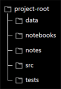

# Data Project Workflows

### How to Use this Guide
- This guide contains several workflow patterns for different aspects of a data projects.
- All steps that require a terminal are completed using BASH unless otherwise noted.
- It is assumed that the project was set up based on the instructions found in *[Data Project Creation/Installation Instructions](data_project_installation_instructions.md)*:
	- There is a dev tools CLI (command line interface) script `tools.py` located in the project's root directory.
	- The directory structure of the project is of the following form (note that some directories might be missing if they're not needed for the given project)
		<div align="center">
			
		</div>
	- (Optionally) There is a directory called `src` that holds the files for a website that is set up with `tailwind` CSS.
- The workflow patterns may be used multiple times depending on the project.
- This guide is not meant to be read in its entirety, it is primarily a reference. To use, just skip around to the topics you need using the links found in the *Topics* section below.
- **Activate the `conda` environment associated with the project**
	> **It is assumed that there is a Python environment associated with the project and that it is activated prior to using any of the workflow patterns in this guide unless otherwise specified.**
	- To activate:
		```shell
		conda activate <env_name>
		```

### Topics
- The following section links are listed in order of likely frequency of use:
	- *[Dev Tools](#dev-tools)*
	- *[Dash App (Plotly Dash Website)](#dash-app-plotly-dash-website)*
	- *[Git](#git)*
	- *[Python Environment](#python-environment)*
	- *[Jupyter Lab Settings](#jupyter-lab-settings)*
	- *[Extras](#extras)*

___

### Dev Tools
#### Run Dev Tool Script
- Current dev tools:
	- `black` - code formatter
	- `blacken-docs` - code formatter for markdown code blocks in jupyter notebooks (`.ipynb`) and markdown files (.md). Runs on jupyter notebooks by default. Not run on markdown files by default, see the `-md|--markdown` cli option.
	- `isort` - import formatter
	- `interrogate` - docstring coverage
	- `flake8` - linter
	- `mypy` - type checker
- By default, running `tools.py` with no options will run these dev tools on jupyter notebooks only, on the current working directory (note that some of the tools have the ability to recursively apply themselves down the directory tree).
- By design, the script is meant to be run from either the project's root directory or any of the top level directories within the root (the script can be run from further down the directory tree but expected behavior is not guaranteed).
- Additionally, CLI options can apply these tools to python and markdown files and also allow for the skipping of tools during run time.
- To see all the CLI options made available by `tools.py`, use the following command to access the help information:
	- From the project's root directory:
		```shell
		python tools.py --help
		```
	- From the `src` or `notebooks` directory (or any other directory at that level):
		```shell
		python ../tools.py --help
		```
- When using the `-md|--markdown` option, filename(s) must be provided. The files must be either jupyter notebooks (`.ipynb`) or markdown files (.md) and must be within the current working directory that you are running the script from.
- When using the `-s|--skip` option, you must provide a single string of one or more tool names separated by spaces and enclosed in quotes.
- When using the `-t|--type` option, you must provide either `all` or `py` as the argument. `all` will run the dev tools on both jupyter notebooks and python files (`.ipynb` and `.py` files). `py` will run the dev tools on python files only (`.py` files).
- Run the dev tools script (shown here with no CLI options):
	- From the project's root directory:
		```shell
		python tools.py
		```
	- From the `src` or `notebooks` directory (or any other directory at that level):
		```shell
		python ../tools.py
		```

*[Return to Topics List](#topics)*

___

### Dash App (Plotly Dash Website)

#### Running the App
- Running the app requires two bash commands that will run two processes continuously to serve the app and serve its styles and update the app when changes are made.
1. Run the `tailwind-watch` script command:
	1. Navigate to the project's `src` folder.
	1. Run the script command:
		```shell
		npm run tailwind-watch
		```
1. In a separate terminal, run the app with a dev server:
	1. Navigate to the project's `src` folder.
	1. Run the app:
		```shell
		python app.py
		```

#### Adding Pages
##### Steps Required for All Pages
- To add a new page to the app there are a few steps that need to be completed:
	1. Add the page and its metadata to the `page_metadata.xlsx`
	2. In the project's root directory, run the `page_metadata.py` file as a module to create the updated `json` file containing all of the page metadata:
	```shell
	python -m data.page_metadata
	```
	3. In the `src > pages` directory, copy a page and rename it with the `module_name` value that was used in `page_metadata.xlsx` for this new page
##### Additional Steps Based on Page Type
###### Generic Pages
 - A page that does not contain a markdown element.
	1. Remove the markdown element (this element is essentially a part of the page template and is not needed for a generic page)
	2. Add content for the generic page
###### Markdown Pages
- A page that contains a markdown element
	1. Add the raw markdown file associated with this new page to the `src > pages_markdown` directory
	2. Adjust any links to be sure they work within this project structure. Since the app is run from the `src` directory, all links should be relative to that directory, not to the `src > pages_markdown` or `src > pages` directories
	3. Add any assets (such as images) that the markdown file uses to the appropriate folder in the `src > assets` directory

#### Adding Styles
- There are three main places where style information can be added to the app and its components:
	1. `tailwind` utility classes within Dash components using the `className` parameter.
	1. Extending/modifying `tailwind` styles using the `tailwind.config.js` file. See the `tailwind` documentation to learn more.
	1. Adding CSS directly to the `input.css` file that gets compiled to an `output.css` file via the `tailwind-watch` script command found in the `package.json` scripts field. The `input.css` file is found at `src > assets > css > src`. See the `tailwind` documentation to learn how to add CSS styles to this file into the correct layers.
- To update styles dynamically during runtime, create a `Dash` callback that has a `className` parameter of the html element of interest as its output and use the following function:
	1. `update_utility_classes()` found in the `funcs.py` file in the `utils` folder.

*[Return to Topics List](#topics)*

___

### Git
- git/GitHub workflows to be added in the future.

*[Return to Topics List](#topics)*

___

### Python Environment
#### Adding/Removing Packages
- `pip` packages will be preferred over `conda` packages. Only install `conda` packages if there is no `pip` equivalent.
- Add (install) packages:
	```shell
	poetry add <package_name>
	```
	- Use this command in place of `pip install <package_name>`.
	- When a version constraint is not included, `poetry` will use the most recent version of the package that is resolvable with the rest of the environment (i.e. most recent version that does not cause a conflict with any of the other packages).
	- To add a package with a specific version constraint use:
		```shell
		poetry add <package_name>=<version_constraint>
		```

- Add (install) packages to a group (for an explanation of groups and to create a group, see the *[Dependency Groups Within `pyproject.toml`](#dependency-groups-within-pyprojecttoml)* section):
	```shell
	poetry add <package_name> --group <group_name>
	```
	- Useful for separating dependencies in the `pyproject.toml` file into logical groups such as grouping the development dependencies together or the test dependencies together.
	> For how to specify version constraints, see the "Version constraints" section of Poetry's [dependency specification](https://python-poetry.org/docs/dependency-specification/).
- Remove (uninstall) packages:
	```shell
	poetry remove <package_name>
	```

#### Updating environment when `environment.yml` changes
- If `conda` dependencies need to be changed (added/removed), `environment.yml` is the file that would be modified to reflect this.
1. With the environment active, update the environment based on the new `environment.yml` file:
	```shell
	conda env update --file environment.yml --prune
	```
	- `--prune` will make sure any dependencies that were removed from `environment.yml` will be uninstalled from the environment.

#### Updating environment when `pyproject.toml` changes
- If non-`conda` dependencies need to be changed (added/removed), `pyproject.toml` is the file that would be modified to reflect this.
- With the environment active, update the environment based on the new `pyproject.toml` or `poetry.lock` file:
	```shell
	poetry install
	```
- If you didn't notice a change to `poetry` files and you get errors when you start working, you might just need to run the command above to install packages that have been recently added by another collaborator.

#### Update `environment.yml` when `conda` packages are added
- With the environment active, write the new changes to the `environment.yml` file with:
	```shell
	conda env export --from-history | grep -v "^prefix: " > environment.yml
	```
	- `--from-history` is important; this updates an environment file based directly on the dependencies when the `conda` environment was created and from any packages added using `conda` during the project (i.e. does not include sub-dependencies, only the top "level" of dependencies).
	- `grep -v "^prefix: "` takes the output from export and only writes the lines that don't start with `"prefix: "` to `environment.yml`. The prefix is just the path to the virtual environment folder and likely includes our computer's username. We leave it out here so that it's not on GitHub and because `conda` doesn't need it when creating the virtual environment.

#### Removing an environment
1. To remove a `conda` environment, use the following command:
	```shell
	conda remove --name <env_name> --all
	```
	- confirm that the environment was removed by checking that it is not in the current list of environments:
		```shell
		conda info --envs
		```
1. Delete the environment's folder on your computer which is usually found in the `~/anaconda3/envs/` directory.
1. Remove the environment's kernel from the jupyter environment:
	```shell
	jupyter kernelspec remove <env_name>
	```

*[Return to Topics List](#topics)*

___

### Jupyter Lab Settings
#### Install Jupyter Lab "Prettier" Contextual Help (done once per environment)
- Install the two packages below to add nice contextual help for a given environment (make sure to have `jupyterlab-pygments` installed. Check to see if it is with `poetry show jupyterlab-pygments`):
	```shell
	# Install sphinx
	poetry add sphinx
	```
	```shell
	# Install docrepr
	poetry add docrepr
	```
- Access the contextual help by placing you cursor in a class/function/method or other object (click the text to place the cursor) and then use the keyboard shortcut `ctrl`+`I`.

*[Return to Topics List](#topics)*

___

### Extras

#### Dependency Groups Within `pyproject.toml`
- Think of dependency groups as labels associated with your dependencies, they are simply a way to organize the dependencies logically.
- The main dependency group is the section with the heading `[tool.poetry.dependencies]`, all dependencies that are needed to **run** the project must be here.
- Other dependency groups (ones that you add yourself) must only contain dependencies you need for development of the project (things like formatters, linters, unit testing libraries, etc.).
- Add a dependency group by editing the `pyproject.toml` file directly, follow the following format which adds a heading:
	```toml
	[tool.poetry.group.<group_name>.dependencies]
	```
- If the plan is to leave the development dependencies in one all encompassing group, a common group name would be `dev`, see the example `pyproject.toml` code block below. Otherwise, you could separate the development dependencies into however many groups that you want. Poetry even allows for installing or synchronizing by groups, so multiple groups for different purposes could be useful.

#### Example `pyproject.toml`
- The fields with the comment `# Required (non-null)` below get set when `poetry init` is called during project setup but can also be modified afterwards by editing `pyproject.toml` directly.
- If there is a `packages` attribute in the `[tool.poetry]` section, remove it. These projects will not be packages.

```toml
[tool.poetry]
name = "dash-test" # Required (non-null)
version = "0.1.0" # Required (non-null)
description = "" # Required (non-null)
authors = ["Joe Shmow <joeshmow@gmail.com>"] # Required
readme = "README.md"

[tool.poetry.dependencies]
python = "^3.9"
dash = "^2.7.0"
ibis-framework = { version = "^3.2.0", python = ">=3.9,<3.11" }

[tool.poetry.group.dev.dependencies]
pytest = "^6.0.0"
pytest-mock = "*"

[build-system]
requires = ["poetry-core"]
build-backend = "poetry.core.masonry.api"
```

#### Run a file individually as a module (useful for debugging)
- The following example is based on the following directory structure:
<div align="center">
	
</div>

1. Navigate to the `src` directory.
1. Run the file from `src` using the `-m` flag and dotted module notation:
	```shell
	python -m components.table
	```

#### Some Reasons for a Conda + Poetry Setup
- "Freeze" type approaches require more manual upkeep of the dependencies file. 2 dependency files (2 non lock files) need to be maintained, one for "production" and one for "development".
- If a project uses conda and you plan to host it online as a website there are fewer hosting services with conda buildpacks (the software that sets up the environment to run your website on a cloud server).
- PYPI packages (installed via poetry) are often more up-to-date, usually by a couple months.
- In the end, having both allows for packages from either conda, conda-forge, or pypi.
- `conda` can be slow.
- Poetry's dependency resolver is more advanced than pip's.
- Poetry, compared to other python environment/dependency managers, seems to have consistent activity on its GitHub and is actively being maintained.

*[Return to Topics List](#topics)*
